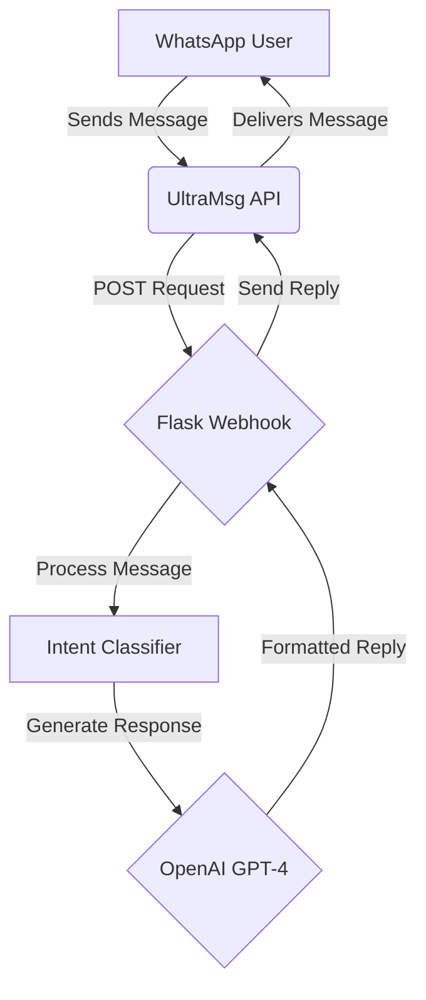

# Hanis WhatsApp Smart Agent

[](https://opensource.org/licenses/MIT)

An intelligent, persona-driven WhatsApp bot that uses OpenAI's GPT-4 to generate context-aware and professional automatic replies. This bot is designed to be easily deployed and configured, making it a powerful tool for managing your WhatsApp communications.

## Table of Contents

- [Overview](#overview)
- [Features](#features)
- [Architecture](#architecture)
- [Prerequisites](#prerequisites)
- [Installation](#installation)
- [Usage](#usage)
- [Contributing](#contributing)
- [License](#license)

## Overview

The Hanis WhatsApp Smart Agent is a Flask-based backend that integrates with the UltraMsg API to send and receive WhatsApp messages. It uses OpenAI's GPT-4 to analyze incoming messages, classify their intent, and generate intelligent, context-aware replies based on a predefined persona.

## Features

- **Persona-Driven Responses**: The bot's replies are guided by a detailed persona, ensuring that the tone and style are always consistent and professional.
- **Intent Classification**: A simple yet effective intent classifier categorizes incoming messages as either from a recruiter, a business opportunity, or an unknown source.
- **Dynamic Replies**: The bot generates unique replies for each message, tailored to the classified intent.
- **Easy to Configure**: All the sensitive information, such as API keys and tokens, is managed through environment variables, making it easy to configure and deploy.
- **Scalable Architecture**: The bot is built with a modular architecture that can be easily extended with new features and capabilities.

## Architecture

The bot's architecture is simple and straightforward. It consists of a Flask web server that exposes a webhook endpoint. When a new message is received, the webhook is triggered, and the bot's logic is executed.



## Prerequisites

Before you can run the bot, you need to make sure you have the following:

- Python 3.7 or higher
- An UltraMsg account with an active instance
- An OpenAI API key

## Installation

1. **Clone the repository:**

   ```bash
   git clone https://github.com/your-username/hanis-whatsapp-bot.git
   cd hanis-whatsapp-bot
   ```

2. **Create a virtual environment:**

   ```bash
   python -m venv venv
   source venv/bin/activate  # On Windows, use `venv\Scripts\activate`
   ```

3. **Install the dependencies:**

   ```bash
   pip install -r requirements.txt
   ```

4. **Configure the environment variables:**

   Create a `.env` file in the root of the project and add the following, replacing the placeholder values with your actual credentials:

   ```
   # UltraMsg API Credentials
   ULTRAMSG_INSTANCE_ID="your_ultramsg_instance_id"
   ULTRAMSG_TOKEN="your_ultramsg_token"

   # OpenAI API Key
   OPENAI_API_KEY="your_openai_api_key"
   ```

## Usage

To start the bot, simply run the following command:

```bash
python hanis_whatsapp_agent.py
```

The bot will start a Flask development server and will be ready to receive messages. You will need to configure your UltraMsg webhook to point to the correct URL.

## Contributing

Contributions are welcome! If you have any ideas, suggestions, or bug reports, please open an issue or submit a pull request.

## License

This project is licensed under the MIT License. See the [LICENSE](LICENSE) file for details.
